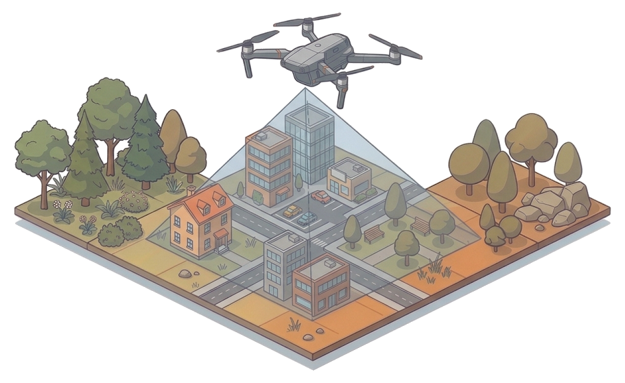
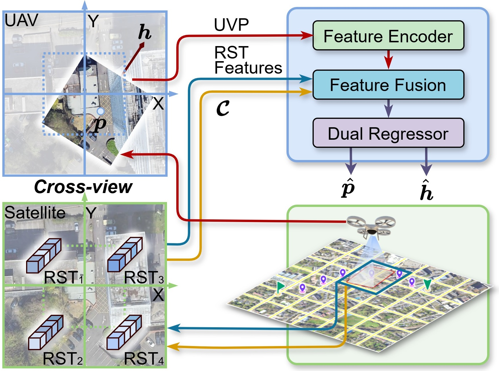
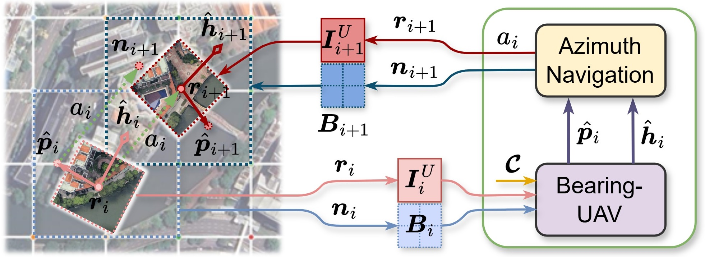
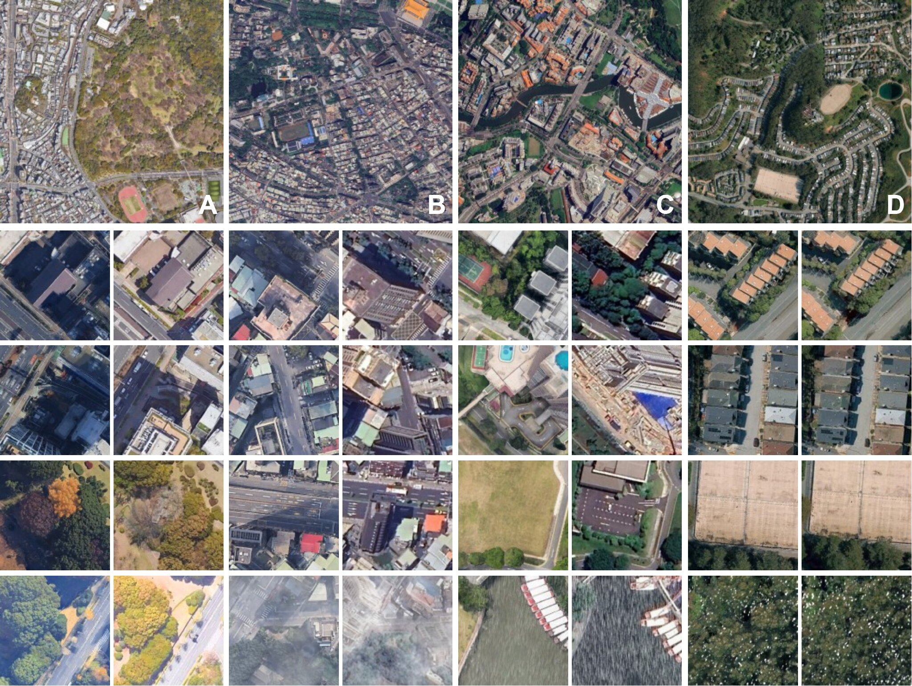

<<<<<<< HEAD
# bearinguav
=======
<div align="center">
  <h1><font color="#0066CC" size="15">Bearing-UAV</font></h1>
</div>

<div align="center">
  
</div>

<div align="center">

[](https://arxiv.org/abs/2603.22153)
[](https://huggingface.co/datasets/HaoyZhou/bearinguav/tree/main)
[](https://huggingface.co/HaoyZhou/bearinguav/tree/main)
[](https://github.com/liukejia121/bearinguav)

</div>

# Introduction

We present Bearing-UAV and its navigation scheme Bearing-Naver. 
✈️**Bearing-UAV** is a purely vision-driven cross-view navigation method that jointly predicts UAV absolute location and heading from neighboring features and current UAV view, enabling accurate, lightweight, and robust navigation in the wild.
<div align="center">
  
</div>

🗺️**Bearing-Naver** is a purely vision-driven point-to-point navigation scheme along specified waypoints in urban scenes. Initialized from a known start position in a certain satellite block with four tiles, this navigation scheme can be summarized as sequentially searching for the next step via Bearing-UAV.
<div align="center">
  
</div>

We also present 🖼️**Bearing-UAV-90K**, a multi-city benchmark for evaluating UAV-satellite cross-view localization and navigation.
<div align="center">
  
</div>


# 🏗️ Architecture
The project follows a structured layout for vision-driven UAV navigation research.

```text
<bearinguav>/                                # [Project Root]
    │
    ├── README.md                            # Main Documentation.
    ├── requirements.txt                     # Dependencies.
    │
    ├── <Bearing_UAV_90K>/                   # [Benchmark]
    │   ├── city_rsi/                        # 4 City Remote Sensing Images.
    │   ├── citya                            # Dataset of City A.
    │   │   ├──uav_254k_37bc_b15_s100(45000) # 22500 UAV-view patches and their json files.
    │   │   ├──sat_254k_37bc_b15_s100(23400) # 22500 Satellite-view patches and 900 remote sensing tiles.
    │   │   └──rawmetadata.csv               # Raw Sample Metadata.
    │   ├── cityb                            # Dataset of City B.
    │   ├── cityc                            # Dataset of City C.
    │   ├── cityd                            # Dataset of City D.
    │   │
    │   ├──c4m_254k_96bc_b15_s100_v3d/       # UAV-Satellite Cross-View Dataset Index Files.
    │   │   └──metadata/
    │   │          └──metadata.csv    
    │   ├──c4m_254k_96bc_b15_s100/           # Satellite-Satellite Reference Dataset Index Files.
    │   ├──c1_254k_96bc_b15_s1_v3d/          # Mini Multi-City Debug Dataset.
    │   ├──c1_254k_96bc_b15_s1/              # Mini Multi-City Debug Dataset.
    │   └──c1_254k_37bc_b15_s1_v3d/          # Mini Single-City Debug Dataset.
    │
    ├── <Bearing_UAV>/                       # [Best Model Weights]
    │   ├── cross_view/                      # UAV-Satellite Cross-View Bearing-UAV.
    │   │   ├──best_model.pth                # Model Weights.
    │   │   └──training_configure.json       # Model Config.
    │   │                     
    │   └── satellite_view/                  # Satellite-Satellite Reference Bearing-UAV.
    │       ├──best_model.pth                # Model Weights.
    │       └──training_configure.json       # Model Config.
    │
    ├── <config>/                            # [Configuration]
    │   ├── base_info.py                     # Base Config.
    │   └── paths.py                         # Path Management.
    │
    ├── <cvphr>/                             # [Core Module]
    │   │
    │   ├── models/                          # Model Definitions.
    │   │   ├── core/                        # Base Models
    │   │   │   └── registry.py              # Registry, Conflict Detection & Builder.
    │   │   └── posaglreg/                   # POSAGLREG Models.
    │   │       └── models.py                # CVPHR model Script.
    │   │
    │   ├── train/                           # Training Module.
    │   │   └── cvphr_train.py               # CVPHR Training Script.
    │   │
    │   ├── test/                            # Testing Module.
    │   │   └── cvphr_test.py                # CVPHR Testing Script.
    │   │
    │   └── utils/                           # Utilities.
    │       ├── utils.py                     # Common Utilities.
    │       └── utils_transform.py           # Common Utilities for transform pipe line.
    │
    ├── <naver>/                             # [UAV Navigation]
    │   └── runners/                         # Navigation Runners.
    │       ├── nav.py                       # Main Navigation Runner.
    │       └── visnav.py                    # Visualization Tools.
    │
    ├── <cvphr/sceneGraphEncodingNet>/       # [Scene Graph Encoding Network]
    │   ├── nets.py                          # Network Definitions.
    │   └── non_local_dot_product.py         # Non-Local Dot Product.
    │
    ├── <source>/                            # [Source Code]
    │   │── uav_logo.py                      # UAV Logo Operations.
    │   │── uav_logo                         # UAV Logo Assets.
    │   │   └── plane.png                    # UAV Logo image.
    │   ├── font/                            # Fonts
    │   │   └── Helvetica.ttc                # CVPR Plotting Font.
    │   └── illustration/                    # Illustration images.
    │
    ├── <scripts>/                           # [Shell Scripts]
    │   ├── cvphr_train.sh                   # CVPHR Training Script.
    │   ├── cvphr_test.sh                    # CVPHR Testing Script.
    │   └── run_nav.sh                       # Navigation script.
    │
    ├── log/                                 # [Logs]
    │   ├── c4ma/                            # Training/Testing Logs.
    │   └── nav/                             # Navigation Logs.
    │
    ├── loc2traj/                            # [Routes & Navigation Results]
    │   └── traj_wps_gcs/                    # Waypoint Path Files (Pre-defined).
    │
    └── results/                             # [Results Output]
        └── c4ma/                            # Model Training & Testing Results (Includes Best Model).
```

# ✨Function

## 📍Model
### [cvphr/train/cvphr_train.py]
    Function: Train CVPHR Model.
    Run: ./scripts/cvphr_train.sh.
### [cvphr/train/cvphr_test.py]
    Function: Test CVPHR Model.
    Run: ./scripts/cvphr_test.sh.

## 📍Navigation
### [naver/runners/nav.py]
    Function: Run UAV Navigation Test & Log Results.
    Prerequisites: waypoint file already in loc2traj/traj_wps_gcs.
    Run: ./scripts/run_nav.sh.

## 📍scripts
    Function: Model training, testing, and navigation inference scripts.

## 📍log，loc2traj，results
    Function: Process Logs and Results.


# ⚙️Virtual Environment Setup

## 📦Create environment
```bash
conda create -n bearing_env python=3.9 -y
conda activate bearing_env
```

## 📦Install PyTorch
```bash
pip install torch==2.1.2 torchvision==0.16.2 torchaudio==2.1.2 \
--index-url https://download.pytorch.org/whl/cu118
```

## 📦Install other dependencies
```bash
pip install -r requirements.txt
```


# 🛠️Usage

## 🔨Code & Dataset
Download BearingUAV source code, dataset (https://huggingface.co/datasets/HaoyZhou/bearinguav/tree/main) and weights (https://huggingface.co/HaoyZhou/bearinguav/tree/main) from GitHub & Hugging Face, extract to appropriate locations.

## 🔨Environment
Clone this repo and install dependencies:
```bash
git clone https://github.com/liukejia121/bearinguav.git
cd /your/path/of/proj/bearinguav
pip install -r requirements.txt
```

## 🔨Operation
### Training
```bash
./scripts/cvphr_train.sh
```

### Testing
```bash
./scripts/cvphr_test.sh
```

### Navigation Test
```bash
./scripts/run_nav.sh
```

# ✒️Citation
```text
@article{xxx2026bearinguav,
  title={Beyond Matching to Tiles: Bridging Unaligned Aerial and Satellite Views for Vision-Only UAV Navigation},
  author={Kejia Liu, Haoyang Zhou, Ruoyu Xu, Peicheng Wang, Mingli Song, Haofei Zhang},
  journal={CVPR},
  year={2026}
}
```
(https://arxiv.org/abs/2603.22153)
>>>>>>> Initial commit
